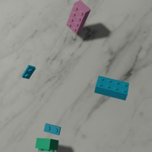
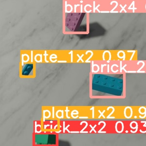
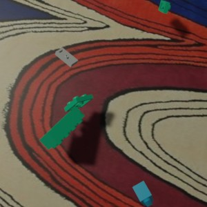
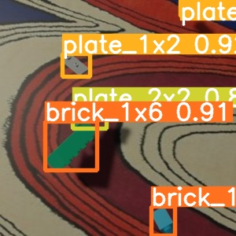
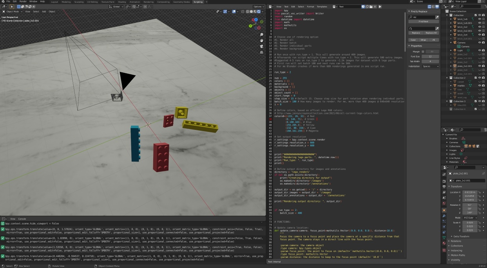

# Lego multi object detection
Synthetic lego dataset for testing multi object detection using machine learning. Annotations saved in PASCAL-VOC format. 
Blender scripts with detailed annotations are provided.

#### Yolo detection on synthetic dataset

#### Yolo detection on real world lego parts (trained on synthetic dataset)

#### 
## Instructions

### 1. Creating synthetic Lego part dataset using Blender 2.93

1. Install required packages for internal Blender Python library to run Blender Python scripts:
	1. cd to your Blender Python dir `cd ~/blender-2.93.4-linux-x64/2.93/python`
	2. install ensurepip `./bin/python3.9 -m ensurepip`
	3. install pip `./bin/python3.9 -m pip install -U pip`
	4. install pascal-voc-writer for annotation extraction `./bin/python3.9 -m pip pascal-voc-writer`
		
2. Copy the contents of `blender` folder from this repo into to your blender directory, for eg. ~/home/blender-2.93.4-linux-x64
3. With Blender open `rendering.blend
4. In Blender open the scripting tab and press run script button to render lego dataset. 
Run the script multiple times to create images in batches (limited to few hundred image rendering for a single batch due to blender memory leaks).
5. Annotations in PASCAL-VOC format and images in JPG format saved in `<your blender directory>/lego_renders`

### 2. Training Multi-object detection with YoloV5 

Using Jupyter notebook open yolov5.ipynb and execute the cells. 

### 3. Training Multi-object detection with SSD

Using Jupyter notebook open ssd_pytorch.ipynb and execute the cells. 

